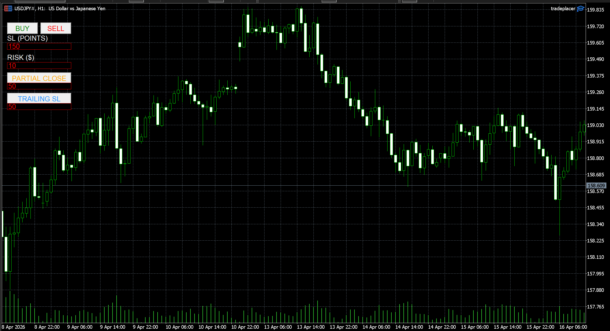

# MT5 Trade Execution & Risk Management Engine

## Problem Statement
Manual execution in MT5 lacks:
- precise risk control  
- fast order placement  
- dynamic position management  

This leads to inconsistent risk and execution errors.

---

## Solution
This project is an automated execution engine that:
- Calculates lot size based on fixed dollar risk  
- Executes trades instantly  
- Applies stop loss automatically  
- Enables partial close  
- Supports trailing stop logic  

---

## Core Logic (Important)

### Risk-Based Position Sizing

Lot size is calculated as:
Lot Size = Risk (USD) / Loss per Lot

Where:
Loss per Lot = (SL Points × Point Value / Tick Size) × Tick Value

---

## Features
- Fixed risk execution  
- Dynamic lot sizing  
- Partial position closing  
- Trailing stop loss  
- Interactive chart UI  

---

## Inputs
- Risk ($)  
- Stop Loss (points)  
- Trailing Stop (points)  
- Partial Close (%)  

---

## Example
Balance: $10,000
Risk: $10
SL: 150 points

→ Lot size auto-calculated
→ Trade executed with SL

---

## Tech Stack
- MQL5  
- MetaTrader 5  

---

## Future Improvements
- Percentage-based risk model  
- Trade logging and analytics  
- Backtesting module  

## User Interface

The execution panel integrated within MT5:

## How to Use

1. Attach the script to an MT5 chart  
2. Enter:
   - Risk ($)
   - Stop Loss (points)
3. Click BUY or SELL  
4. System calculates lot size automatically  
5. Trade is executed with defined risk

## Execution Flow

1. User inputs risk and stop loss  
2. System calculates loss per lot  
3. Lot size is derived based on fixed risk  
4. Trade is executed with SL applied  
5. Optional trailing stop and partial close managed dynamically  
